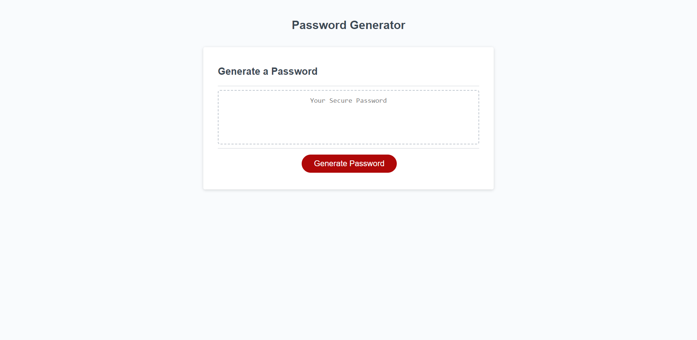

# <password-generator>

## Description

Randomly generated passwords will help with security needs for online accounts. I created this password generator in order to help progress my JavaScript skills. This project will help people randomly generate a password independently from bigger websites. Working on this project helped me learn arrays, objects, and methods on JavaScript.

## Installation

N/A

## Usage

Helps me create an entirely random password at lengths I require.

## Credits

JavaScript Object Methods: https://www.w3schools.com/js/js_object_methods.asp
 
JavaScript Array: https://www.w3schools.com/jsref/jsref_obj_array.asp

# License

Please refer to the LICENSE in the repo.